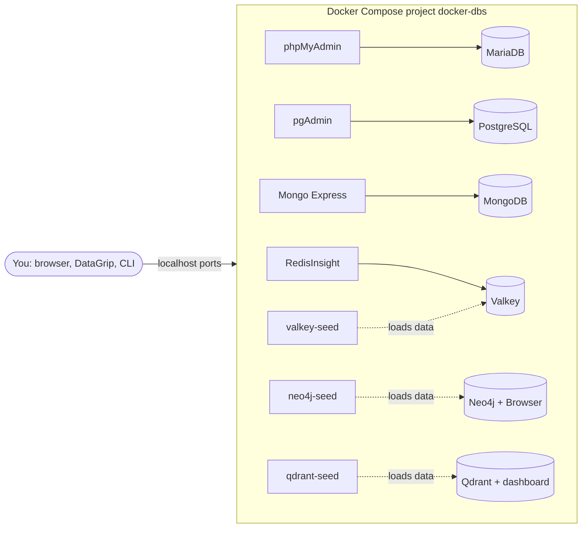

<div align="center">

# docker-dbs

**Six databases for local development, each with a web UI and the same sample data, started with one command**


[](https://github.com/HuberNicolas/docker-dbs/actions/workflows/ci.yml)


[Quick start](#quick-start) · [Services and ports](#services-and-ports) · [Documentation](#documentation)

</div>

A Docker Compose setup for trying out and comparing databases on your own machine. Each database starts with the same
small `tasks` dataset, so you can ask the same question in SQL, MQL, Cypher, Valkey commands and Qdrant's REST API and
compare the answers.

## Features

- 🗄️ **Six databases:** MariaDB, PostgreSQL, MongoDB, Valkey (Redis-compatible), Neo4j and Qdrant
- 🖥️ **A web UI for each:** phpMyAdmin, pgAdmin, Mongo Express, RedisInsight, Neo4j Browser and the Qdrant dashboard
- 🌱 **Same sample data everywhere:** three tasks per database, loaded on first start
- 🎛️ **Profiles:** start everything, or only the database you need
- ✅ **Smoke test:** one script checks the data and the web UIs; CI runs it on every push
- 🔧 **No setup:** works without a `.env` file; ports and credentials can be overridden

> [!NOTE]
> I built the first version in September 2023 to learn Docker Compose with MariaDB, PostgreSQL and MongoDB.
> In October 2026 I updated it: pinned current image versions, healthchecks, named volumes, profiles, three more
> databases and a smoke test. The original state is tagged as [`v1.0.0`](https://github.com/HuberNicolas/docker-dbs/tree/v1.0.0).

> [!WARNING]
> This is for local development only. The default passwords are public (they are in this README), and every port is
> published on all network interfaces of your machine. Do not run this setup on a server.

## Contents

- [Tech stack](#tech-stack)
- [Architecture](#architecture)
- [Repository structure](#repository-structure)
- [Quick start](#quick-start)
- [Services and ports](#services-and-ports)
- [Configuration](#configuration)
- [Sample data](#sample-data)
- [Development](#development)
- [Documentation](#documentation)
- [Known issues](#known-issues)
- [License](#license)
- [Author](#author)

## Tech stack

| Area | Technology |
| --- | --- |
| Relational |   |
| Document |  |
| Key-value |  |
| Graph |  |
| Vector |  |
| Web UIs |     |
| Infrastructure |   |

## Architecture



| What | Where |
| --- | --- |
| Services, ports, volumes, profiles | [`compose.yaml`](compose.yaml) |
| Sample data loaded by the image on first start | [`mariadb/init/`](mariadb/init), [`postgres/init/`](postgres/init), [`mongodb/init/`](mongodb/init) |
| Sample data loaded by a one-off seed container | [`valkey/seed.sh`](valkey/seed.sh), [`neo4j/seed.cypher`](neo4j/seed.cypher), [`qdrant/seed.sh`](qdrant/seed.sh) |
| Data | Named Docker volumes (`docker-dbs_mariadb-data`, …) |

MariaDB, PostgreSQL and MongoDB run the files in `/docker-entrypoint-initdb.d` when their volume is empty. Valkey,
Neo4j and Qdrant have no such mechanism, so a `*-seed` container loads their data once the database is healthy. It
then stays up and reports healthy, so `docker compose up --wait` returns only when all sample data is in (Compose
treats containers that exit as failures). The seed scripts can run more than once without creating duplicates.

## Repository structure

| Path | Content |
| --- | --- |
| [`compose.yaml`](compose.yaml) | All services |
| [`.env.example`](.env.example) | Every setting with its default |
| [`mariadb/`](mariadb) | Init SQL |
| [`postgres/`](postgres) | Init SQL and the pgAdmin server list |
| [`mongodb/`](mongodb) | Init script for mongosh |
| [`valkey/`](valkey), [`neo4j/`](neo4j), [`qdrant/`](qdrant) | Seed scripts |
| [`scripts/smoke-test.sh`](scripts/smoke-test.sh) | Checks data and web UIs of all running services |
| [`docs/`](docs) | Guides per database, desktop clients, troubleshooting |
| [`.github/workflows/ci.yml`](.github/workflows/ci.yml) | Starts everything and runs the smoke test |

## Quick start

You need [Docker](https://docs.docker.com/get-docker/) with Compose v2. With all six databases, the images take about
4.3 GB of disk and the running stack about 1.5 GB of RAM.

1. Clone the repository:

   ```bash
   git clone git@github.com:HuberNicolas/docker-dbs.git
   ```

   ```bash
   cd docker-dbs
   ```

2. Start everything and wait until all services are healthy:

   ```bash
   docker compose --profile all up -d --wait
   ```

   Or start only one database with its UI, for example PostgreSQL and pgAdmin:

   ```bash
   docker compose --profile postgres up -d --wait
   ```

3. Check that the data is there:

   ```bash
   scripts/smoke-test.sh
   ```

4. Open a web UI from the [table below](#services-and-ports).

5. Stop everything (the data stays in the volumes):

   ```bash
   docker compose --profile all down
   ```

6. Stop everything and delete all data, so the sample data is loaded again on the next start:

   ```bash
   docker compose --profile all down -v
   ```

> [!TIP]
> Set `COMPOSE_PROFILES=all` (or `postgres,mongodb`, …) in `.env`, and the `--profile` flag is no longer needed.

## Services and ports

Profiles: `mariadb`, `postgres`, `mongodb`, `valkey`, `neo4j`, `qdrant` and `all`.

| Profile | Service | URL / address | Login (default) |
| --- | --- | --- | --- |
| `mariadb` | MariaDB | `localhost:3307` | `mariadb-user` / `mariadb-user-pw`, root: `mariadb-root-pw` |
| | phpMyAdmin | <http://localhost:8081> | same as MariaDB |
| `postgres` | PostgreSQL | `localhost:5433` | `postgres-user` / `postgres-user-pw` |
| | pgAdmin | <http://localhost:5051> | `admin@example.com` / `pgadmin-user-pw` |
| `mongodb` | MongoDB | `localhost:27018` | `mongodb-root` / `mongodb-root-pw` |
| | Mongo Express | <http://localhost:8082> | `mongo-express-user` / `mongo-express-user-pw` |
| `valkey` | Valkey | `localhost:6380` | password `valkey-pw` |
| | RedisInsight | <http://localhost:5540> | none |
| `neo4j` | Neo4j Browser | <http://localhost:7474> | `neo4j` / `neo4j-user-pw` |
| | Neo4j Bolt | `neo4j://localhost:7687` | same |
| `qdrant` | Qdrant REST API | <http://localhost:6333> | header `api-key: qdrant-api-key` |
| | Qdrant dashboard | <http://localhost:6333/dashboard> | API key `qdrant-api-key` |

Inside the Compose network, services reach each other by service name, for example `postgres:5432` or `mongodb:27017`.
pgAdmin already lists the PostgreSQL server as `docker-dbs`; it asks for the password when you first connect.

## Configuration

Everything works without a `.env` file. To change a port or a password, copy the example and edit it:

```bash
cp .env.example .env
```

| Variable | Default | Meaning |
| --- | --- | --- |
| `COMPOSE_PROFILES` | (unset) | Profiles to start without `--profile` |
| `MARIADB_PORT`, `PHPMYADMIN_PORT` | `3307`, `8081` | Host ports |
| `MARIADB_ROOT_PASSWORD`, `MARIADB_USER`, `MARIADB_PASSWORD` | see table above | MariaDB accounts |
| `POSTGRES_PORT`, `PGADMIN_PORT` | `5433`, `5051` | Host ports |
| `POSTGRES_USER`, `POSTGRES_PASSWORD` | see table above | PostgreSQL superuser |
| `PGADMIN_DEFAULT_EMAIL`, `PGADMIN_DEFAULT_PASSWORD` | see table above | pgAdmin login |
| `MONGODB_PORT`, `MONGO_EXPRESS_PORT` | `27018`, `8082` | Host ports |
| `MONGODB_ROOT_USERNAME`, `MONGODB_ROOT_PASSWORD` | see table above | MongoDB root user |
| `MONGO_EXPRESS_USERNAME`, `MONGO_EXPRESS_PASSWORD` | see table above | Mongo Express basic auth |
| `VALKEY_PORT`, `REDISINSIGHT_PORT` | `6380`, `5540` | Host ports |
| `VALKEY_PASSWORD` | `valkey-pw` | Valkey `requirepass` |
| `NEO4J_HTTP_PORT`, `NEO4J_BOLT_PORT` | `7474`, `7687` | Host ports |
| `NEO4J_PASSWORD` | `neo4j-user-pw` | Password of the `neo4j` user (8+ characters) |
| `QDRANT_PORT` | `6333` | Host port |
| `QDRANT_API_KEY` | `qdrant-api-key` | Qdrant API key |

MariaDB, PostgreSQL, MongoDB, pgAdmin and Neo4j only read their users and passwords when the volume is created. After
changing one of them, run `docker compose --profile all down -v` once.

## Sample data

Every database gets the same three tasks, in a database or collection called `task_db` / `tasks`:

| id | name | description | completed | priority | due_date |
| --- | --- | --- | --- | --- | --- |
| 1 | Task 1 | Description of Task 1 | false | 2 | 2023-07-29 |
| 2 | Task 2 | Description of Task 2 | true | 1 | 2023-07-30 |
| 3 | Task 3 | Description of Task 3 | false | 3 | 2023-07-31 |

How each database stores them, with a first query for each, is in [docs/databases.md](docs/databases.md).
The data is made up and part of this repository.

## Development

| Task | Command / guide |
| --- | --- |
| Validate `compose.yaml` | `docker compose --profile all config --quiet` |
| Check data and web UIs | `scripts/smoke-test.sh` |
| Follow the logs of one service | `docker compose logs -f postgres` |
| Open a shell in a database container | `docker compose exec postgres sh` |
| Reload the sample data | `docker compose --profile all down -v`, then start again |
| Update an image | Change the tag in `compose.yaml`, then `docker compose --profile all pull` |
| Fix a problem | [docs/troubleshooting.md](docs/troubleshooting.md) |

## Documentation

| Guide | Content |
| --- | --- |
| [docs/databases.md](docs/databases.md) | Each database: data model, CLI access, first queries |
| [docs/desktop-clients.md](docs/desktop-clients.md) | Connecting DataGrip and other desktop clients |
| [docs/troubleshooting.md](docs/troubleshooting.md) | Port conflicts, stale volumes, slow starts |

## Known issues

- **RedisInsight** asks you to accept its EULA on first start. The Valkey connection is set through the `RI_REDIS_*`
  variables, but whether it appears right after the EULA dialog has not been checked yet (see [TODO.md](TODO.md)).
- **Mongo Express** `1.0.2` is the newest release. It works with MongoDB 8.0; newer MongoDB versions were not tested.

## License

The code in this repository is licensed under the [MIT License](LICENSE). The Docker images are not part of this
repository and keep their own licenses (for example SSPL for MongoDB, GPLv3 for Neo4j Community Edition, and the
Redis terms for RedisInsight).

## Author

**Nicolas Huber** ([@HuberNicolas](https://github.com/HuberNicolas)). Personal learning project from September 2023,
updated in October 2026.
